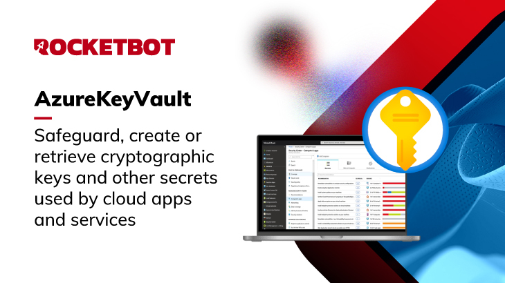

# Azure Key Vault
  
Este modulo permite que usted proteja, cree o recupere claves criptográficas y otros secretos usados por aplicaciones y servicios en la nube.  

*Read this in other languages: [English](Manual_AzureKeyVault.md), [Português](Manual_AzureKeyVault.pr.md), [Español](Manual_AzureKeyVault.es.md)*
  

## Como instalar este módulo
  
Para instalar el módulo en Rocketbot Studio, se puede hacer de dos formas:
1. Manual: __Descargar__ el archivo .zip y descomprimirlo en la carpeta modules. El nombre de la carpeta debe ser el mismo al del módulo y dentro debe tener los siguientes archivos y carpetas: \__init__.py, package.json, docs, example y libs. Si tiene abierta la aplicación, refresca el navegador para poder utilizar el nuevo modulo.
2. Automática: Al ingresar a Rocketbot Studio sobre el margen derecho encontrara la sección de **Addons**, seleccionar **Install Mods**, buscar el modulo deseado y presionar install.  

## Como usar este módulo

Antes de usar este módulo, es necesario registrarse en el portal de Azure https://portal.azure.com y crear tu “Key Vault”:

1. **Accede al portal de Azure**

2. **Crea un nuevo Key Vault:**
  En la barra de búsqueda, escribe "Key Vault" y selecciona "Azure Key Vault", haz clic en Crear.

  

3. **Configura los detalles del Key Vault:**

    - Suscripción: Selecciona la suscripción en la que deseas crear el Key Vault.
    - Grupo de recursos:
      Elige un grupo de recursos existente o crea uno nuevo.
    - Nombre del Key Vault:
      Escribe un nombre único para el Key Vault (debe ser globalmente único).
    - Región:
      Selecciona la región donde se almacenará el Key Vault.
    - Opciones de red:
      Elige si deseas que el acceso sea público o restringido a redes privadas.

4. **Revisa y crea**

# Pasos para ingresar a Azure y conectarse al baúl de llaves:

1. **Crear una Aplicación de Azure AD (Service Principal) | registro de aplicaciones**
    - Obtener client_id, tenant_id y client_secret
    - Client ID (ID de la aplicación): Se encuentra en la sección de resumen de tu aplicación.
    - Tenant ID (ID del directorio): También está en el resumen de tu aplicación.
    - Client Secret (secreto del cliente):
      - Ve a "Certificados y secretos" en el registro de la aplicación.
      - Crea un nuevo secreto de cliente  y asegúrate de copiar y guarda el valor, ya que no podrás verlo nuevamente.

2. **Asignar Acceso a la Aplicación en el Key Vault**
    - Ve a tu Key Vault en el portal.
    - Selecciona "Políticas de acceso" en el menú lateral.
    - Haz clic en "Agregar política de acceso".
    - Asigna permisos según las necesidades, por ejemplo:
      - Permisos de secreto: Obtener, enumerar, establecer.
      - Permisos de clave: Obtener, enumerar, crear, importar.
      - Permisos de certificado: Obtener, enumerar, administrar
    - Selecciona la aplicación registrada (Service Principal) bajo Principal.
    - Guarda los cambios.

## Descripción de los comandos

### Conectarse al baúl de llaves
  
Con este comando puedes conectarte al baul de llaves de Azure.
|Parámetros|Descripción|ejemplo|
| --- | --- | --- |
|url de tu baul de llaves|Url del baul de llaves obtenida en el servicio de Azure key vault|https://rocketbot.vault.azure.net/|
|ID. de directorio (Inquilino)|ID del directorio que puedes obtener de la pagina principal de tu aplicación|468fab45-2d6c-4164-a97d-52b88c1ee45c|
|Id. de aplicación (Cliente)|Id de aplicación (cliente) obtenido en la página principal de la aplicación creada en azure|e827a5a7-ec88-45b2-89c9-0641289ef14b|
|Valor de ID de secreto|Valor del secreto obtenido en el menú, certificados y secretos de la aplicación|_d18Q~ceU4Pbcxy4TAbnMm1p6ArcidqegYSAFaYJ|
|Nombre de la variable donde asignar el resultado|Variable donde se guardará el resultado de la conexión|variable|

### Obtener secreto
  
Con este comando puedes obtener un secreto de Azure Key Vault
|Parámetros|Descripción|ejemplo|
| --- | --- | --- |
|Escribe el nombre de tu secreto|Nombre del secreto que quieres obtener|Secret1|
|Nombre de la variable donde asignar el resultado|Variable donde se guardará el secreto|variable|

### Crear o modificar secreto
  
Con este comando puedes crear o modificar un secreto en Azure Key Vault
|Parámetros|Descripción|ejemplo|
| --- | --- | --- |
|Escribe el nombre de tu secreto|Si el nombre existe lo va a actualizar, si no existe, lo va a crear.|Secret1|
|Valor del secreto|El valor del secreto|12345|

### Actualizar la propiedad del secreto
  
Con este comando puedes actualizar la propiedad del secreto (como tipo, habilitado/deshabilitado)
|Parámetros|Descripción|ejemplo|
| --- | --- | --- |
|Escribe el nombre de tu secreto|Nombre del secreto del cual quieres actualizar sus propiedades|Secret1|
|Habilitar/Deshabilitar|Habilitar o deshabilitar el secreto||
|Tipo de contenido del secreto (Opcional)|Tipo de contenido que quiere que tenga su secreto (ejemplo text/plain)|Text/plain|

### Eliminar secreto
  
Con este comando puedes eliminar un secreto.
|Parámetros|Descripción|ejemplo|
| --- | --- | --- |
|Escribe el nombre del secreto que deseas eliminar|Nombre del secreto del cual quieres actualizar sus propiedades|Secret1|
