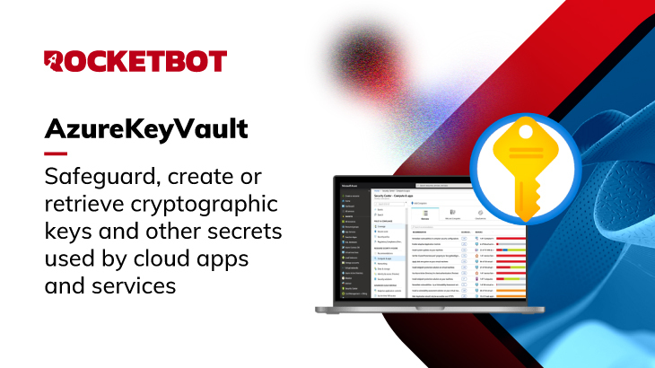

# Azure Key Vault
  
Este modulo permite que você proteja, crie ou recupere chaves criptográficas e outros segredos usados por aplicativos e serviços em nuvem.  

*Read this in other languages: [English](Manual_AzureKeyVault.md), [Português](Manual_AzureKeyVault.pr.md), [Español](Manual_AzureKeyVault.es.md)*
  

## Como instalar este módulo
  
Para instalar o módulo no Rocketbot Studio, pode ser feito de duas formas:
1. Manual: __Baixe__ o arquivo .zip e descompacte-o na pasta módulos. O nome da pasta deve ser o mesmo do módulo e dentro dela devem ter os seguintes arquivos e pastas: \__init__.py, package.json, docs, example e libs. Se você tiver o aplicativo aberto, atualize seu navegador para poder usar o novo módulo.
2. Automático: Ao entrar no Rocketbot Studio na margem direita você encontrará a seção **Addons**, selecione **Install Mods**, procure o módulo desejado e aperte instalar.  

## Como usar este módulo

Antes de utilizar este módulo, você precisa se cadastrar no portal Azure https://portal.azure.com e criar seu “Key Vault”:

1. **Acesse o portal do Azure**

2. **Crie um novo Cofre de Chaves:**
    Na barra de pesquisa, digite "Key Vault" e selecione "Azure Key Vault", clique em Criar.

3. **Configure os detalhes do Key Vault:**
    - Assinatura: selecione a assinatura na qual deseja criar o Key Vault.
    - Grupo de recursos:
      Escolha um grupo de recursos existente ou crie um novo.
    - Nome do Cofre de Chaves:
      Insira um nome exclusivo para o Key Vault (deve ser globalmente exclusivo).
    - Região:
      Selecione a região onde o Key Vault será armazenado.
    - Opções de rede:
      Escolha se deseja que o acesso seja público ou restrito a redes privadas.

4. **Revise e crie**

# Etapas para entrar no Azure e conectar-se ao cofre de chaves:

1. **Crie um aplicativo Azure AD (principal de serviço) | registro de inscrição**
    - Obtenha client_id, tenant_id e client_secret
    - ID do Cliente: Encontrado naseção de resumo do seu aplicativo.
    - ID do locatário: também está no resumo da sua inscrição.
    - Segredo do cliente:
    - Acesse “Certificados e segredos” no cadastro do aplicativo.
    - Crie um novo segredo do cliente e copie e salve o valor, pois você não poderá vê-lo novamente.

2. **Atribua acesso ao aplicativo no Key Vault**
    - Vá para o seu Key Vault no portal.
    - Selecione “Políticas de Acesso” no menu lateral.
    - Clique em “Adicionar política de acesso”.
    - Atribua permissões conforme necessário, por exemplo:
      - Permissões secretas: obter, listar, definir.
      -  Permissões principais: Obter, Listar, Criar, Importar.
      - Permissões de certificado: obter, listar, gerenciar
    - Selecione o aplicativo registrado (Principal de Serviço) em Principal.
    - Salve as alterações.

## Descrição do comando

### Conectar cofre de chaves

Com este comando, você pode se conectar ao chaveiro Azure.
|Parâmetros|Descrição|exemplo|
| --- | --- | --- |
|url de seu cofre de senhas|Url do cofre de chaves obtido do serviço de Azure Key vault|https://rocketbot.vault.azure.net/|
|Tenant ID|ID do diretório que você pode obter na página inicial de sua aplicação.|468fab45-2d6c-4164-a97d-52b88c1ee45c|
|Client ID|Id da aplicação (cliente) obtida da página inicial da aplicação criada em azure.|e827a5a7-ec88-45b2-89c9-0641289ef14b|
|Valor ID secreto|Valor do segredo obtido na seção, certificados e segredos do pedido..|_d18Q~ceU4Pbcxy4TAbnMm1p6ArcidqegYSAFaYJ|
|Nome da variável onde atribuir o resultado|Variável onde o resultado da conexão será salvo|variable|

### Obter segredo
  
Com este comando você pode obter um segredo do Cofre de Chaves Azure
|Parâmetros|Descrição|exemplo|
| --- | --- | --- |
|Nome de seu segredo|Nome do segredo que você deseja obter|Secret1|
|Nome da variável onde atribuir o resultado|Variável onde o segredo será salvo|variable|

### Criar ou modificar o segredo
  
Com este comando, você pode criar ou modificar um segredo no Cofre de Chaves Azure.
|Parâmetros|Descrição|exemplo|
| --- | --- | --- |
|Nome de seu segredo|Se o nome existir, ele o atualizará, se não existir, ele o criará.|Secret1|
|Valor do segredo|O valor do segredo|12345|

### Atualizar propiedade do segredo
  
Com este comando você pode atualizar a propriedade secreta (como o tipo, habilitado/desabilitado).
|Parâmetros|Descrição|exemplo|
| --- | --- | --- |
|Nome de seu segredo|Nome do segredo para o qual você deseja atualizar suas propriedades|Secret1|
|Habilitar/Desabilitar|Habilitar ou desabilitar o segredo||
|Tipo de conteúdo do segredo (Opcional)|Tipo de conteúdo que você quer que seu segredo tenha (por exemplo, text/plain)|Text/plain|

### Retirar o segredo
  
Com este comando você pode apagar um segredo.
|Parâmetros|Descrição|exemplo|
| --- | --- | --- |
|Digite o nome do segredo que você deseja apagar|Nome do segredo para o qual você deseja atualizar suas propriedades|Secret1|
